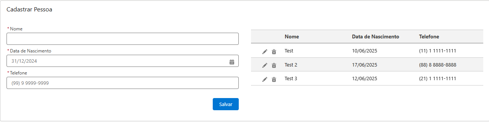

## 🧾 Tela de Cadastro de Pessoa - Salesforce (Aura)



Este projeto implementa uma **tela de cadastro de pessoa** utilizando **Aura Components** no Salesforce. Ele permite ao usuário inserir e salvar informações básicas em um registro customizado via controller Apex.

### 🎓 Contexto

Este projeto foi desenvolvido como **solução para o desafio do programa Start by Capgemini**, dentro da trilha de **Salesforce** e do curso de **Aura Components**. O desafio consistia em criar uma tela funcional de cadastro que se comunicasse com um controller Apex.

---

### ⚙️ Pré-requisitos

Antes de executar o projeto, é necessário configurar os seguintes recursos na sua org Salesforce:

#### 1️⃣ Criar o objeto personalizado `Pessoa__c`

- Vá até **Object Manager** > **Create** > **Custom Object**.
    
- Nome: `Pessoa`
    
- API Name: `Pessoa__c`
    
- Permitir relatórios e histórico conforme necessário.
    

#### 2️⃣ Criar os seguintes campos personalizados:

|Campo|Tipo|API Name|
|---|---|---|
|Nome|Texto|`Nome__c`|
|Data de Nascimento|Data|`Data_de_Nascimento__c`|
|Telefone|Telefone|`Telefone__c`|

---

### 📁 Estrutura do Projeto

```bash
cadastro-aura/
├── classes/
│   ├── PessoaController.cls              # Classe Apex para lidar com os dados
│   └── PessoaController.cls-meta.xml     # Metadados do controller
├── aura/
│   ├── CadPessoaApplication/
│   │   ├── CadPessoaApplication.app
│   │   └── CadPessoaApplication.app-meta.xml
│   └── CadPessoaComponent/
│       ├── CadPessoaComponent.cmp             # Componente visual Aura
│       ├── CadPessoaComponent.cmp-meta.xml    # Metadados do componente
│       ├── CadPessoaComponentController.js    # Lógica client-side
│       └── CadPessoaComponentHelper.js        # Funções auxiliares
```
---

### 🧠 Funcionalidades

- Interface simples e objetiva para cadastro de dados de uma pessoa.
    
- Integração com Apex para persistência de dados.
    
- Feedback visual ao usuário após tentativa de cadastro.
    

---

### ▶️ Como usar

1. Importe todos os arquivos no seu ambiente Salesforce Developer (via VS Code + Salesforce CLI ou Developer Console).
    
2. Implante os arquivos de classe Apex e Aura.
    
3. Crie o objeto `Pessoa__c` e os campos personalizados conforme descrito acima.
    
4. Acesse a URL da aplicação `CadPessoaApplication.app` para usar a tela de cadastro.
    

---

### 🛠️ Requisitos

- Salesforce Developer Edition
    
- Permissão para criar classes Apex e componentes Aura
    
- Permissão para criar objetos e campos personalizados
